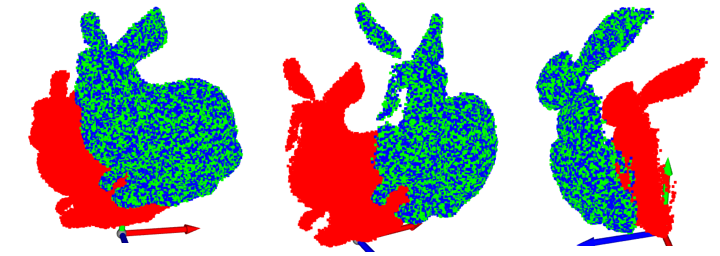
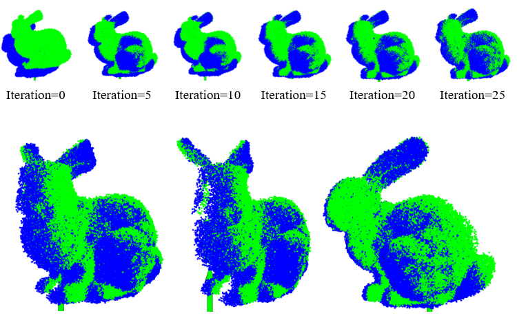

## ICP for matched point cloud
We write an SVD-based ICP algorithm to calculate the transformation from the point cloud 1 (bunny1.ply) to point cloud 2 (bunny2.ply). The correspondence of two point clouds is matched with the same column of point cloud array.

The blue one is the transformed point cloud1 and the green one is the point cloud 2 and they are overlapped.

## ICP for unmatched point cloud
Suppose that the 2 point clouds don’t have the correspondence and we should regard the nearest neighbor point as corresponding point. First, we find the nearest point in point cloud 2 to build the correspondence with the point cloud 1. Then we implement the ICP method mentioned in task1 to solve the transformation matrix. 

The green points are the point cloud 2 and the blue points are the transformed point cloud 1. With the increasing iterations, the overlap part of the points is larger and larger. After 30 iterations, the two point clouds are nearly matched. 

## Files
* `screenshot of task 2` The visualization of each iteration in the window. 
* `detail.txt` The current transformation T and accumulated T printed in the console. The time cost will also be printed after iteration stops. 